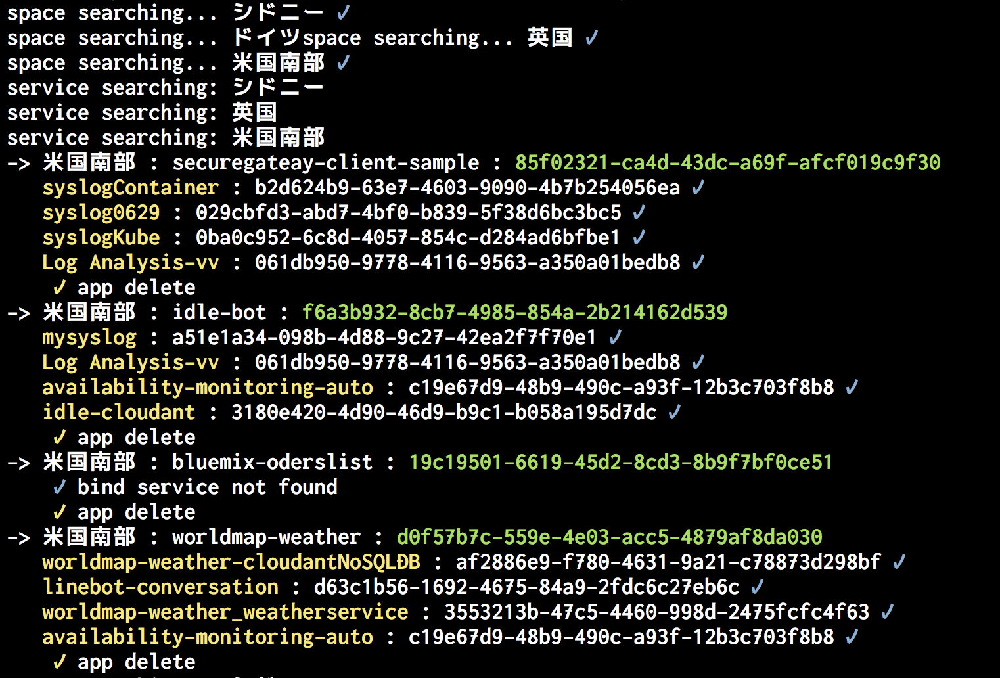

# 用途

Bluemixのスペース以下のリソースを全て削除するためのツール

* アプリケーション／サービスを一括で削除します。
* 実行には、組織(`-o`)とスペース(`-s`)を指定します。
* 全てのリージョンで動作します。特定のリージョンのみを実施することは出来ません。
* 削除に関して確認はされませんので注意して利用してください

# Usage

```
export APIKEY="<YOUR APIKEY>" ; python cleanup.py -s <SPACENAME> -o <ORGNAME>
```

実行結果例

